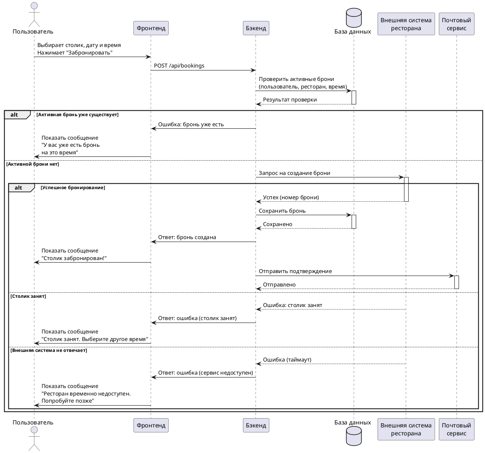

# Sequence diagram бронирования

Диаграмма отражает процесс бронирования от действия пользователя до ответа внешней системы ресторана.

## Краткое описание

- Пользователь отправляет запрос на бронирование через фронтенд.
- Бэкенд сначала проверяет в БД, нет ли активной брони на то же время.
- Если дубля нет, бэкенд обращается во внешнюю систему ресторана и при успехе сохраняет бронь.
- После успешного сохранения пользователь получает подтверждение, а почтовый сервис отправляет уведомление.
- В случае занятости столика или таймаута внешней системы пользователю возвращается понятная ошибка.
