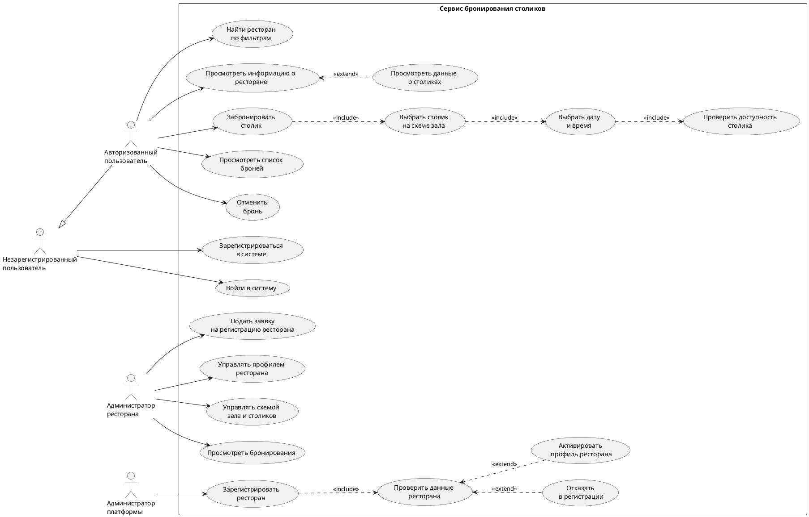

# Use Case диаграмма

Диаграмма показывает роли пользователей и ключевые сценарии в сервисе бронирования столиков.

## Краткое описание

- Гость может зарегистрироваться и войти в систему.
- Авторизованный пользователь ищет ресторан, просматривает карточку, выбирает столик/время и создает бронь.
- Администратор ресторана подает заявку, управляет профилем и схемой зала, отслеживает бронирования.
- Администратор платформы проверяет данные ресторана и принимает решение о регистрации.
